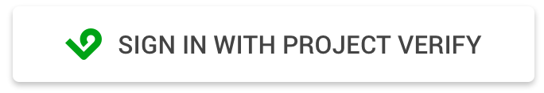

# iOS Integration Guide

This guide is for developers integrating Project Verify into their iOS applications.

## Background

Project Verify is a joint undertaking of the Mobile Authentication Taskforce. The taskforce provides customers with the ability to use their mobile phone number to sign into apps. Project Verify is built on top of OpenID Connect (OIDC).

### OpenID Connect

OpenID Connect (OIDC) is an authentication protocol based on the OAuth 2.0  specification. It uses JSON Web Tokens (JWTs) that are obtained using OAuth 2.0 flows. You can read more about OIDC [here](https://openid.net/specs/openid-connect-core-1_0.html).

Project Verify SDK supports the authorization code flow for web and native applications. In the flow, the user is redirected to Mobile Network Operator (MNO) for authorization. Upon successful authorization, the user is redirected to your backend with an authorization code, which your backend exchanges for an ID token. This flow enhances security, as `clientId`, `clientSecret` and user ID token are not revealed to your client.

Because each carrier operates its own authorization servers, we determine the user's MNO prior to authentication. This process is called MNO Discovery (MNO Discovery is an OIDC discovery with extra parameters). MNO Discovery returns the OIDC of the user's MNO. This ensures that the discovery document from Project Verify is for the correct MNO. 

## Getting Started

Before you integrate with Project Verify, you need to register an application and obtain valid `clientId` and `clientSecret` from the Portal or by contacting a Customer Operation Specialist. If you choose to use a custom redirect URI, then ensure that you specify a valid URI.  

### Open ID Connect Client

This SDK relies on *AppAuth* as an Open Id Connect client.
For more information about AppAuth, see the repository [here](https://github.com/openid/AppAuth-iOS).

### Pre-Release Git Access

While the SDK is under development, we recommend maintaining the Provider SDK source code as a [git submodule](https://git-scm.com/docs/git-submodule). If that is not possible, download the source [here](https://git.xcijv.net/sp-sdk/sp-sdk-ios) and place it in your project directory.

```bash
git submodule add https://git.xcijv.net/sp-sdk/sp-sdk-ios
```

### Client Information and Scopes

Service providers decide how much client information they obtain from the user. In your setup, you can choose to have an experience with or without requiring a PIN or a biometric.

Since applications must get authorization to access user information, scopes are used to define allowed actions. Scopes are implemented by the OpenID Connect protocol and can be set to request profile information (email address, name, phone ...) to verify users. OpenID is the only required scope and is added by default on every request. All others are optional depending on the needs of your application.

## Add Project Verify SDK 

During development, include the ProjectVerifyLogin SDK in your project. There are currently two ways to integrate Project Verify (and its dependency `AppAuth`) in your project: as a submodule of CocoaPods or manually. Additionally, Carthage may be supported in the future. 

### CocoaPods

You can include the ProjectVerifyLogin SDK in your project as a development Cocoapod. After you place the source code in your repository, add the following to your Podfile.

```ruby
  pod 'CarriersSharedAPI', path: '{your-relative-path}/CarriersSharedAPI.podspec'
```

Then run `pod install`. This adds the local source as well as `AppAuth` to your application's workspace.

### Carthage

More information coming soon - *Carthage* may be supported in the future.

### Adding Project Verify SDK Manually

You can add the ProjectVerifyLogin SDK to your project manually. For an example of a project that links ProjectVerifyLogin manually, see  [SocialApp](https://git.xcijv.net/sp-sdk/sp-sdk-ios/tree/develop/Example/SocialApp).

1. Retrieve the source for `ProjectVerifyLogin`. We recommend adding it as a [submodule](#pre-release-git-access).

2. After you clone the repository, run `git submodule update --init --recursive` to recursively clone `AppAuth`.

3. If you cannot access submodules, then you must separately clone `AppAuth` and set your working copy to the release tag you would like to target. This SDK currently supports version [0.95.0](https://github.com/openid/AppAuth-iOS/releases/tag/0.95.0).

## Configure Project Verify SDK 

After you add the source via submodule or manually, then configure the Project Verify SDK as follows:

1. Add `CarriersSharedAPI.xcodeproj` to your application's Xcode project.

2. After adding the project, confirm that the deployment targets are less than or equal to your deployment target.

3. Ensure that `AppAuth` is linked to `CarriersSharedAPI` and included as a "Target Dependency" in the `CarrierSharedAPI` build phases.

4. View your project's "Embedded Binaries" under your project's "General" panel. Add both `AppAuth` and `CarriersSharedAPI` frameworks. Be sure to select the corresponding framework for the platform you're targeting (the iOS framework for an iOS target).

Build and run to ensure that everything is working correctly.

## Integration

To integrate Project Verify into your iOS application, configure your Info.plist with ClientId and instantiate Project Verify in your application delegate.  

### Configure Property List

Retrieve your application's `clientId` from the Project Verify dashboard. Add the following keys to Info.plist in your application:

```xml
	<key>ProjectVerifyClientId</key>
	<string>{your application's client id}</string>
	<key>CFBundleURLTypes</key>
	<array>
		<dict>
			<key>CFBundleTypeRole</key>
			<string>Editor</string>
			<key>CFBundleURLName</key>
			<string>{your bundle id}</string>
			<key>CFBundleURLSchemes</key>
			<array>
				<string>{your application's client id}</string>
			</array>
		</dict>
	</array>
```

For examples of how to configure the property list, see the [Social App](https://git.xcijv.net/sp-sdk/sp-sdk-ios/tree/develop/Example/SocialApp), and [Bank App](https://git.xcijv.net/sp-sdk/sp-sdk-ios/tree/develop/Example/BankApp).

### Using a Custom Redirect URI

If you would like to use universal links for your redirect scheme, it is possible to configure a custom URL scheme and a custom URL host.

The following keys are made available for you to customize the structure of the redirect URL:

```xml
    <key>ProjectVerifyCustomScheme</key>
    <string>{your application's custom scheme}</string>
    <key>ProjectVerifyCustomHost</key>
    <string>{your application's custom host}</string>
```

**Note:** For schemes other than `https`, you must add the scheme to your application's `CFBundleURLTypes` list.

For an example of how to configure property lists for these custom keys, see the [Photo App](https://git.xcijv.net/sp-sdk/sp-sdk-ios/tree/develop/Example/PhotoApp).

Redirect URLs will require the universal links to route the following paths to the application: `/authorize` and `/discoveryui`.
For more information about universal links, read Apple's [documentation on the topic](https://developer.apple.com/documentation/uikit/core_app/allowing_apps_and_websites_to_link_to_your_content/enabling_universal_links).

#### Project Verify Redirects

We recommend that you use either the default URL scheme (your Project Verify client ID) or a universal linking scheme to support Project Verify redirects. Other URL schemes may be owned by other applications and can introduce unexpected behavior. For more information, view [Apple's documentation](https://developer.apple.com/documentation/uikit/core_app/allowing_apps_and_websites_to_link_to_your_content/defining_a_custom_url_scheme_for_your_app) on defining a custom URL scheme.

## Instantiate Project Verify

To support Project Verify, you must instantiate Project Verify in your application delegate:

```swift
import CarriersSharedAPI

class AppDelegate: UIResponder, UIApplicationDelegate {
    func application(_ application: UIApplication,
     didFinishLaunchingWithOptions launchOptions: [UIApplicationLaunchOptionsKey: Any]?) -> Bool {

        ProjectVerifyAppDelegate.shared.application(
            application,
            didFinishLaunchingWithOptions: launchOptions
        )

        // Perform additional application setup.

        return true
    }

    func application(_ app: UIApplication,
                     open url: URL,
                     options: [UIApplication.OpenURLOptionsKey: Any] = [:]) -> Bool {

        guard !ProjectVerifyAppDelegate.shared.application(app, open: url, options: options) else {
            return true
        }
        // Perform any other URL processing your app may need to perform.
        return true
    }
}
```

## Request Authorization Code

The SDK provides a branded button called `ProjectVerifyAuthorizationButton` that automatically handles Project Verify authorization.

### Add Verify Button

Add the Project Verify  `ProjectVerifyAuthorizationButton` to your UIView. 

```swift
import CarriersSharedAPI

class LoginViewController {
    let projectVerifyButton = ProjectVerifyAuthorizationButton()

    override func viewDidLoad() {
        super.viewDidLoad()

        let scopes: [Scope] = [.profile, .email]
        projectVerifyButton.scopes = scopes
        projectVerifyButton.delegate = self
        
        view.addSubview(projectVerifyButton)
    }
}
```
For examples of how the button works with both Interface Builder and Autolayout, see the example [Branding Project](https://git.xcijv.net/sp-sdk/sp-sdk-ios/tree/develop/Example/ProjectVerifyBranding).

#### Dark Button

You can customize the appearance of the button. A dark button style is appropriate to use with light backgrounds. By default, the Project Verify button uses the dark style specified as follows:

```swift
    projectVerifyButton 
```
The dark button style looks like this:

 

#### Light Button

A light button style is appropriate to use with dark backgrounds. For the light style, add the light parameter specified as follows: 

```swift
    projectVerifyButton.style = .light
```
The light button style looks like this:
 


### Receive Callbacks

In order to receive the outcome of your Project Verify request, implement the `ProjectVerifyAuthorizeButtonDelegate` and handle the events.

```swift
extension LoginViewController: ProjectVerifyAuthorizeButtonDelegate {

    func buttonWillBeginAuthorizing(_ button: ProjectVerifyAuthorizeButton) {
        // perform any ui updates like showing an activity indicator.
    }

    func buttonDidFinish(
        _ button: ProjectVerifyAuthorizeButton,
        withResult result: AuthorizationResult) {

        // handle the outcome of the request:
        switch result {
        case .code(let authorizedResponse):
            let code = authorizedResponse.code
            let mcc = authorizedResponse.mcc
            let mnc = authorizedResponse.mnc
            // pass these identifiers to your secure server to perform a token request
        case .error:
            // handle the error case appropriately
        case .cancelled:
            // perform any work required when the user cancels
        }
    }
}
```

### Set Scopes (optional) 

By default, authorization requests made with the Project Verify SDK include the OpenId scope. To use additional scopes, set them on the button and they will be added to the request. 

```swift
    let scopes: [Scope] = [.profile, .email]
```

For more information, see [Scope.swift](https://git.xcijv.net/sp-sdk/sp-sdk-ios/blob/develop/CarriersSharedAPI/Sources/Core/Scope.swift).

## Request Authorization Code Manually

For a more hands-on approach, you can perform a manual authorization request with `AuthorizationService`. 
Pass the code and associated identifiers to your secure server to complete the token request flow.

```swift
import CarriersSharedAPI

class LoginViewController {

    let authService = AuthorizationService()

    func loginWithProjectVerify() {
        // in response to some UI, perform an authorization using the AuthorizationService
        let scopes: [Scope] = [.profile, .email]
        authService.connectWithProjectVerify(
            scopes: scopes,
            fromViewController: self) { result in

            switch result {
            case .code(let authorizedResponse):
                let code = authorizedResponse.code
                let mcc = authorizedResponse.mcc
                let mnc = authorizedResponse.mnc
                // pass these identifiers to your secure server to perform a token request
            case .error:
                // handle the error case appropriately
            case .cancelled:
                // perform any work required when the user cancels
            }
        }
    }
}
```
For more information, see the following:  

* [submodules](https://git-scm.com/docs/git-submodule)
* [projectVerifyLogin](https://git.xcijv.net/sp-sdk/sp-sdk-ios)
* [appAuth](https://github.com/openid/AppAuth-iOS)

## Next Steps

On your secure server, you perform discovery and use the discovered token endpoint to request an access token from Project Verify with the processes already detailed: 

* Auth Code
* MCC
* MNC

The token should be used as the basis for accessing or creating a token within the domain of your application. After you exchange the authorization code for an authorization token on your secure server, you will be able to access the Project Verify User Info Endpoint.

The Project Verify User Info Endpoint should pass information through your server's authenticated endpoints in a way that makes sense for your application. 

## Support

For technical questions, contact [support](mailto:support@mobileauthtaskforce.com).

## Proprietary and Confidential

NOTICE: © 2019 XCI JV, LLC.  ALL RIGHTS RESERVED. XCI JV, LLC PROPRIETARY AND CONFIDENTIAL. THE INFORMATION CONTAINED HEREIN IS NOT AN OFFER, COMMITMENT, REPRESENTATION OR WARRANTY AND IS SUBJECT TO CHANGE. CONFIDENTIAL MATERIAL DISCLOSED FOR REVIEW ONLY AS PERMITTED UNDER THE MUTUAL NONDISCLOSURE AGREEMENT.  NO RECIPIENT MAY DISCLOSE, DISTRIBUTE, OR POST THIS DOCUMENT WITHOUT XCI JV, LLC’S EXPRESS WRITTEN AUTHORIZATION.

<sub> Last Update:
Document Version 0.9.6 - May 28, 2019</sub>
