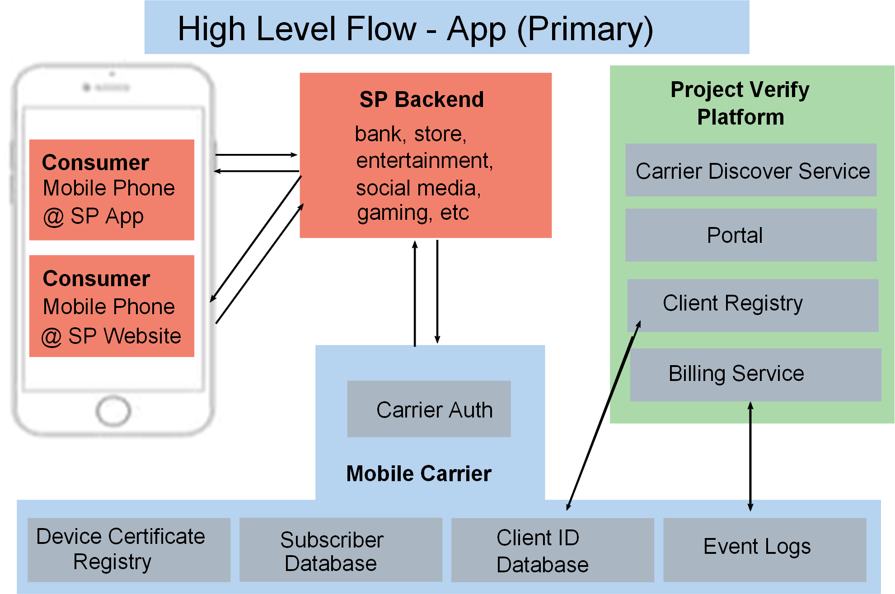
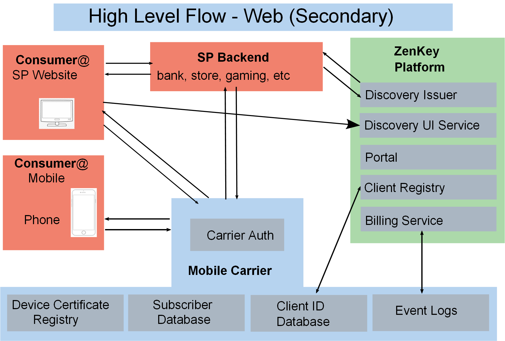

# iOS Integration Guide

This guide is for developers integrating ZenKey with their iOS applications.

## 1.0 Background

ZenKey is a joint undertaking of the Mobile Authentication Taskforce. The taskforce provides customers with the ability to use their mobile phone number to sign into apps. ZenKey is built on top of OpenID Connect (OIDC).

### 1.1 OpenID Connect

OpenID Connect (OIDC) is an authentication protocol based on the OAuth 2.0 specification. It uses JSON Web Tokens (JWTs) that are obtained using OAuth 2.0 flows. You can read more about OIDC [here](https://openid.net/specs/openid-connect-core-1_0.html).

### 1.2 Authorization Code Flow and Carrier Discovery

ZenKey SDK supports the authorization code flow for web and native applications. In the flow, the user is redirected to the carrier for authorization. Upon successful authorization, the user is redirected to your application with an authorization code, which you should exchange from your secure backend exchanges for an ID token and access token. This flow enhances security, as `clientId`, `clientSecret` and user ID token are not revealed to your client.

Because each carrier operates its own authorization servers, we determine the user's carrier prior to authentication. This process is called Carrier Discovery (this is an OIDC Discovery with extra parameters). This ensures that the discovery document from ZenKey is for the correct carrier.

### 1.3 High Level Architecture

ZenKey brings the four main US phone carriers together with a common user authentication experience backed by carrier device authentication. The solution enables two main flows at initial launch (app and web). The app flow is for  service provider (SP) native apps or a SP-browser based websites that are on the same device as ZenKey. The web flow shows secondary device support when the SP website is accessed from a device other than a user’s primary phone.

As the first image shows, consumers from their primary phone access ZenKey either from the SP app or SP website. As a service provider developer, you sign up and log in through the ZenKey portal, then write code in your backend. The architecture looks like this:

 

The flow goes from consumer through service provider website, to service provider backend, to mobile carrier, to ZenKey and back again.

As the second image shows, consumers from their secondary device (such as a laptop) can access ZenKey from the SP website. The architecture looks like this:

 

The user receives a visual or numeric code with which to confirm their identity with their primary phone. Once they have done this  they can log in with their secondary device.

Consumer verification and authorization flows to Carrier auth, the service provider backend, ZenKey platform and mobile carrier as follows:

* Discovery
* Authorization code request, universal link captured
* SIM and user authentication, explicit user consent (via the primary device)
* Authorization code returned, deep or universal link
* Service provider integrated clients
* Token request
* Userinfo mobile carrier resource

## 2.0 Getting Started

Before you integrate with ZenKey, register your application and obtain valid `clientId` and `clientSecret` from the portal or by contacting a Customer Operation Specialist.

### 2.1 Client Information and Scopes

Service providers decide how much client information they obtain from the user. In your setup, you can choose to have an experience with or without requiring a PIN or a biometric.

Since applications must get authorization to access user information, scopes are used to define allowed actions. Scopes are implemented via OIDC and can be set to request profile information (such as email address, name, phone) to verify users. OpenID is the only required scope. All others are optional depending on the needs of your application.

### 2.2 Pre-Release Git Access

While the SDK is under development, we recommend maintaining the Provider SDK source code as a [git submodule](https://git-scm.com/docs/git-submodule). If that is not possible, download the source [here](https://git.xcijv.net/sp-sdk/sp-sdk-ios) and place it in your project directory.

```bash
git submodule add https://git.xcijv.net/sp-sdk/sp-sdk-ios
```

## 3.0 Add ZenKey SDK

During development, include the ProjectVerifyLogin SDK in your project. There are currently two ways to integrate ZenKey in your project: via CocoaPods or as a git submodule. Carthage may be supported in the future.

### 3.1 CocoaPods

You can include the ProjectVerifyLogin SDK in your project as a development CocoaPod. After you place the source code in your repository, add the following to your Podfile.

```ruby
  pod 'CarriersSharedAPI', path: '{your-relative-path}/CarriersSharedAPI.podspec'
```

Then run `pod install`. This adds the local source to your application's workspace.

### 3.2 Carthage

More information coming soon - *Carthage* may be supported in the future.

### 3.3 Adding ZenKey SDK Manually

You can add the ProjectVerifyLogin SDK to your project manually:

1. Retrieve the source code. We recommend adding it as a [submodule](#pre-release-git-access), but you may also copy the source into a directory manually.

1. Add `CarriersSharedAPI.xcodeproj` to your application's Xcode project.

1. After adding the project, confirm that the deployment targets are less than or equal to your deployment target.

1. View your project's "Embedded Binaries" under your project's "General" panel. Add the `CarriersSharedAPI` framework. Be sure to select the corresponding framework for the platform you are targeting (the iOS framework for an iOS target).

1. Build and run to ensure that everything is working correctly.

## 4.0 Integration

To integrate ZenKey into your iOS application you must first configure your `Info.plist` with your ZenKey client Id as well as your chosen redirect URI.

### 4.1 Client ID
All Service providers must add their application’s client Id to their `Info.plist`. Retrieve your client Id from the ZenKey dashboard and add the following key to your application’s `Info.plist`:

```xml
    <key>ProjectVerifyClientId</key>
    <string>{your application's client id}</string>
```

### 4.2 Choosing a Redirect URI
In addition to configuring a your client Id, Service providers must also specify one or more valid redirect URIs. The redirect URI will be passed as a vehicle for callbacks to the SDK to several ZenKey services. To make it easy to get up and running with ZenKey, all Service Providers are pre-configured with the redirect URI: `{your client Id}://com.xci.provider.sdk`. If you would like to use a different redirect URI you must configure it in the Service Provider Portal. See section 4.2.1 for more information.

In order to get up and running with this default configuration, all you need to do is to add your client Id as a custom scheme to your Info.plist:

```xml
    <key>CFBundleURLTypes</key>
    <array>
        <dict>
            <key>CFBundleTypeRole</key>
            <string>Editor</string>
            <key>CFBundleURLName</key>
            <string>{your bundle id}</string>
            <key>CFBundleURLSchemes</key>
            <array>
                <string>{your application's client id}</string>
            </array>
        </dict>
    </array>
```

#### 4.2.1 Specifying a custom URI
If you would like to add an extra layer of security to your integration, we recommend specifying your redirect URI as a **universal link**. This requires that you have the appropriately configured app association and entitlements. For more information on universal links, see Apple’s [documentation on the topic](https://developer.apple.com/documentation/uikit/core_app/allowing_apps_and_websites_to_link_to_your_content/enabling_universal_links). To use a custom url as your redirect URI, specify your custom scheme, host, and path in your `Info.plist`.

```xml
    <key>ProjectVerifyCustomHost</key>
    <string>{your universal link's host}</string>
    <key>ProjectVerifyCustomPath</key>
    <string>{your universal link's full path}</string>
    <key>ProjectVerifyCustomScheme</key>
    <string>https</string>
```

## 5.0 Instantiate ZenKey

To support ZenKey, you must instantiate ZenKey in your application delegate:

```swift
import CarriersSharedAPI

class AppDelegate: UIResponder, UIApplicationDelegate {
    func application(_ application: UIApplication,
     didFinishLaunchingWithOptions launchOptions: [UIApplicationLaunchOptionsKey: Any]?) -> Bool {

        ProjectVerifyAppDelegate.shared.application(
            application,
            didFinishLaunchingWithOptions: launchOptions
        )

        // Perform additional application setup.

        return true
    }

    func application(_ app: UIApplication,
                     open url: URL,
                     options: [UIApplication.OpenURLOptionsKey: Any] = [:]) -> Bool {

        guard !ProjectVerifyAppDelegate.shared.application(app, open: url, options: options) else {
            return true
        }
        // Perform any other URL processing your app may need to perform.
        return true
    }
}
```
**NOTE:** To pass a log level to the launch options to enable logging, include the `projectVerifyOptions` parameter. Refer to section 8.1 of this document for the loglevel options..

## 6.0 Request Authorization Code

The SDK provides a branded button called `ProjectVerifyAuthorizationButton` that automatically handles ZenKey authorization.

### 6.1 Add Verify Button

Add the ZenKey  `ProjectVerifyAuthorizationButton` to your UIView.

```swift
import CarriersSharedAPI

class LoginViewController {
    let projectVerifyButton = ProjectVerifyAuthorizationButton()

    override func viewDidLoad() {
        super.viewDidLoad()

        let scopes: [Scope] = [.openid, .email, .name]
        projectVerifyButton.scopes = scopes
        projectVerifyButton.delegate = self

        view.addSubview(projectVerifyButton)
    }
}
```

#### 6.1.1 Dark Button

You can customize the appearance of the button. A dark button style is appropriate to use with light backgrounds. By default, the ZenKey button uses the dark style specified as follows:

```swift
    projectVerifyButton
```
The dark button style looks like this:

 

#### 6.1.2 Light Button

A light button style is appropriate to use with dark backgrounds. For the light style, add the light parameter specified as follows:

```swift
    projectVerifyButton.style = .light
```
The light button style looks like this:


#### 6.1.3 Custom Button or View

Add a custom button or view instead of the default **ProjectVerifyAuthorizationButton** to match the theme of your app or flow. Add the implementation details as noted in section 7.0, " Request Authorization Code Manually". 

### 6.2 Receive Callbacks

In order to receive the outcome of your ZenKey request, implement the `ProjectVerifyAuthorizeButtonDelegate` and handle the events.

```swift
extension LoginViewController: ProjectVerifyAuthorizeButtonDelegate {

    func buttonWillBeginAuthorizing(_ button: ProjectVerifyAuthorizeButton) {
        // perform any ui updates like showing an activity indicator.
    }

    func buttonDidFinish(
        _ button: ProjectVerifyAuthorizeButton,
        withResult result: AuthorizationResult) {

        // handle the outcome of the request:
        switch result {
        case .code(let authorizedResponse):
            let code = authorizedResponse.code
            let mcc = authorizedResponse.mcc
            let mnc = authorizedResponse.mnc
            // pass these identifiers to your secure server to perform a token request
        case .error(let authorizationError):
            // error is returned identity provider
        case .cancelled:
            //cancelled is users action in application 
        }
    }
}
```

### 6.3 Request Parameters

There are several parameters that you may wish to configure for your authorization request, as noted in this section.

#### 6.3.1 Scopes

By you should always include the `.openid` scope. To use additional scopes, set them on the button and they will be added to the request.

```swift
    let scopes: [Scope] = [.openid, .email, .name]
```

For more information, see [Scope.swift](https://git.xcijv.net/sp-sdk/sp-sdk-ios/blob/develop/CarriersSharedAPI/Sources/Core/Scope.swift).

#### 6.3.2 Additional Parameters

Additionally, it is possible to configure the following parameters:

* ACR Values - Authenticator Assurance Levels (AAL) which identify The strength of an authentication transaction. Stronger authentication (a higher AAL) requires malicious actors to have better capabilities and expend greater resources in order to successfully subvert the authentication process. Values returned in id_token will contain `aalx`. 

  * SP’s should ask for aal1 when they need a low level of authentication, users will not be asked for their pin or biometrics. Any user holding the device will be able to authenticate/authorize the transaction unless the user has configured their account to always require 2nd factor (pin | bio).
  * SP’s should ask for aal2 or aal3 anytime they want to ensure the user has provided their (pin | bio). 

* Request State - 

* Nonce - A number used once. This is any Service Provider supplied value included in the ID_Token if SP
  asked for the openid scope. 

* Correlation Id - SPs may pass a correlation id to be added to MNO logs. SPs must work with the CCID onboarding portal to request any log entries.  

  **Note:** an SP should use the same correlation_id for code, token, and userinfo requests. But MNO’s may not enforce this. 

* Context - SPs will be able to submit “text string” for authorization by the user.  Best practice is a server-initiated request should contain a context parameter, so that a user understands the reason for
  the interaction.  Maximum size will be <280> characters. Any request with a context that is too large will result in an OIDC error. (invalid request).  

* Prompt - The user needs to approve a transaction with each request. 

  * prompt=None - should always return “user interaction required” which is a standard
    oauth2 response to this request.
  * prompt=login - SP asks user to authenticate again
  * prompt=consent - SP asks user to explicitly re-confirm user agrees to exposure of their data. (Carrier recaptures user consent for listed scopes) 

For more information about each of these parameters and instructions on how to use them, view the documentation for the `ProjectVerifyAuthorizeButton`.

## 7.0 Request Authorization Code Manually

For a more hands-on approach, you can perform a manual authorization request with `AuthorizationService`.
Pass the code and associated identifiers to your secure server to complete the token request flow.

```swift
import CarriersSharedAPI

class LoginViewController {

    let authService = AuthorizationService()

    func loginWithProjectVerify() {
        // in response to some UI, perform an authorization using the AuthorizationService
        let scopes: [Scope] = [.openid, .email, .name]
        authService.authorize(
            scopes: scopes,
            fromViewController: self) { result in

            switch result {
            case .code(let authorizedResponse):
                let code = authorizedResponse.code
                let mcc = authorizedResponse.mcc
                let mnc = authorizedResponse.mnc
                // pass these identifiers to your secure server to perform a token request
            case .error:
                // handle the error case appropriately
            case .cancelled:
                // perform any work required when the user cancels
            }
        }
    }
}
```

Refer to:
* [Submodules](https://git-scm.com/docs/git-submodule)
* [ProjectVerifyLogin](https://git.xcijv.net/sp-sdk/sp-sdk-ios)

## 8.0 Error Handling

`AuthorizationError` defines the `code`, `description` and `errorType` to help the developer debug the error or present a description to the user. The `errorType` is of type `ErrorType` which identifies a class of error during the Authorization flow, such as`invalidRequest` or `requestDenied`. The developer can include further information, with `code` adding context for the origin of the error, `description` a possible explanation and possible remedy.

The following table summarizes the `AuthorizationError` error types and potential recovery suggestions for each.

| Error Type (Case) | Possible Cause | How to Remedy |
|------------------ | -------------- | ------------- |
| invalidRequest | The request made is invalid. | Check the parameters passed to the authorization call. |
| requestDenied | The request was denied by the user or carrier. | Display an appropriate feedback message to the user. |
| requestTimeout | The request has timed out. | Display an appropriate feedback message, such as "Unable to reach the server, please try again" or "Poor network connection." |
| serverError | There was an error on the server. | Please try again later. |
| networkFailure | There was a problem communicating over the network. | Advise the user to check their connection and try again. |
| configurationError | There is an error configuring the SDK. | Confirm your configuration locally and with the service provider portal. |
| discoveryStateError | There is an inconsistency with the user's state. | Try to perform the authorization request again. |
| unknownError | An unknown error has occurred. | If the problem persists, contact support. |

### 8.1 Debugging
It is possible to enable logging by passing a value for the `.logLevel` key via the to the `projectVerifyOptions` parameter in the `ProjectVerifyAppDelegate`. For more information on the options, see the `Log.LogLevel` type  as shown below (source is *Log.swift*).

```swift
/// A logging structure. Pass a log level to the project verify launch options to enable logging
/// for use during debugging.
public struct Log {
    static private(set) var logLevel: Level = .off

    public enum Level: Int {
        case off, error, warn, info, verbose

        var name: String {
            switch self {
            case .off:
                return ""
            case .warn:
                return "warn"
            case .error:
                return "error"
            case .info:
                return "info"
            case .verbose:
                return "verbose"
            }
        }
    }

    static func configureLogger(level: Level) {
        logLevel = level
    }

```

## 9.0 Next Steps

On your secure server, perform discovery and use the discovered token endpoint to request an access token from ZenKey with the processes already detailed:

* Auth Code
* MCC (Mobile Country Code)
* MNC (Mobile Network Code)
* Redirect URI

The token should be used as the basis for accessing or creating a token within the domain of your application. After you exchange the authorization code for an authorization token on your secure server, you will be able to access the ZenKey User Info Endpoint, which should pass information through your server's authenticated endpoints in a way that makes sense for your application.

Information on setting up your secure server can be found in the ZenKey Server and Web Integration Guide.

## Support
For technical questions, contact [support](mailto:techsupport@mobileauthtaskforce.com).

## Proprietary and Confidential

NOTICE: © 2019 XCI JV, LLC.  ALL RIGHTS RESERVED. XCI JV, LLC PROPRIETARY AND CONFIDENTIAL. THE INFORMATION CONTAINED HEREIN IS NOT AN OFFER, COMMITMENT, REPRESENTATION OR WARRANTY AND IS SUBJECT TO CHANGE. CONFIDENTIAL MATERIAL DISCLOSED FOR REVIEW ONLY AS PERMITTED UNDER THE MUTUAL NONDISCLOSURE AGREEMENT.  NO RECIPIENT MAY DISCLOSE, DISTRIBUTE, OR POST THIS DOCUMENT WITHOUT XCI JV, LLC’S EXPRESS WRITTEN AUTHORIZATION.

## Revision History

| Date   | Version      | Description |
| -------- | --------- | ------------------------------------------------------ |
|8.27.2019 | 0.9.10     | Added section numbers; Added revision history; Added additional info about Redirect URIs to section 4.0 |

<sub> Last Update: Document Version 0.9.10 - August 27, 2019</sub>