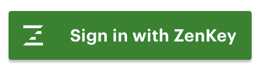
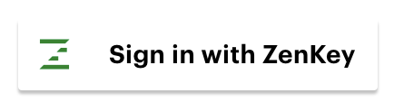

# iOS Integration Guide

This guide is for developers integrating ZenKey with their iOS applications.

## 1.0 Background

ZenKey is a secure bridge between your users and the apps and services you provide. The platform is a joint undertaking of the Mobile Authentication Taskforce, a joint venture of the four major US wireless carriers.

ZenKey leverages encryption technologies in a user's mobile phone and mobile network. The platform packages multiple factors of authentication into a streamlined experience for app and website providers, taking advantage of the unique capabilities and insights of the wireless carriers. It then applies those capabilities to provide an easy and secure way to register, login, and perform other types of authorizations within apps and services. The result for Service Providers (SP) is a better user experience and a more secure link to your users.

ZenKey makes integration easy by following the OpenID Connect (OIDC) authentication protocol.

### 1.1 OpenID Connect

OpenID Connect (OIDC) is an authentication protocol based on the OAuth 2.0 specification. It uses JSON Web Tokens (JWTs) obtained using OAuth 2.0 flows. The ZenKey SDK uses OIDC to support developers creating experiences in web and native applications. You can read more about OIDC [here](https://openid.net/specs/openid-connect-core-1_0.html).

### 1.2 Authorization Flow

ZenKey is simple to use – one method for users to authenticate into all of your apps and websites. 

#### 1.2.1 Authorization on a Primary Device

Users establish their mobile device as their primary device by installing the carrier specific ZenKey app on that device. After completing a simple initial setup, users are ready to use ZenKey with third-party applications. Pressing the ZenKey button in a third party app or website from their primary device starts the authentication process.

*Note:* This primary device is also the device users can use to authenticate requests from other devices, such as desktops and tablets. See Section 1.2.2 Authorization on Secondary Devices.

**Step 1:** &nbsp; The User's Service Provider's mobile app or website makes an authorization code request to the local ZenKey app.

**Step 2:** &nbsp; The User's ZenKey app determines the appropriate wireless carrier to perform SIM and user authentication with and returns an authorization code to your Redirect URI (see section on Redirect URI).

**Step 3:** &nbsp; Because your user has consented to share with you, your backend server may make a token request for user info or other resources.

#### 1.2.2 Authorization on Secondary Devices

Users can also use ZenKey to authenticate on devices other than their primary device, such as a tablet. These secondary devices rely on the user to complete the authentication process.

Users pressing the ZenKey button on a secondary device will see a visual and numeric code as a part of the secondary device authorization process. This code allows the user to associate that secondary device with their primary device. 

**Step 1:** &nbsp; The user is taken to a website where they can select the appropriate carrier. This is known as the carrier Discovery UI website, and is where the user chooses the carrier associated with their primary device. If the user is authorizing a secondary device from an app on a tablet, the SDK will use a webview for this step.

**Step 2:** &nbsp; The user then scans the visual code or enters the numeric code into the ZenKey app on their primary device.

**Step 3:** &nbsp; Once the user approves the request in the ZenKey app on their primary device, the carrier Discovery UI website gets redirected to perform authorization with a `login_hint_token`.

**Step 4:** &nbsp; Your backend server makes an authorization code request to the appropriate carrier, to perform SIM and user authentication, and receives the auth code back at your Redirect URI.

**Step 5:** &nbsp; Because you user has consented to share with you, your backend server may make a token request for user info or other resources.

### 1.3 User Data

To create a secure experience, users are only shared via a web request from your secure backend to the user's carrier's secure backend and includes the user's attributes. 

 User information is only shared with Service Providers upon user consent. Users are able to choose whether to share their data and specifically what data will be shared with you.

## 2.0 Getting Started

To get started integrating the ZenKey with your applications, there are a few things you should do:

* Register your application - Access the Service Provider portal to register your application and obtain a valid `clientId` and `clientSecret`.
* Identify if you need custom redirect URIs - Redirect URIs will be used for callbacks to several ZenKey services
* Identify user information data you want to capture - The ZenKey enrollment process includes asking for personal user data. The ZenKey service itself does not accumulate the personal data used for authentication. That data remains secured by the user's wireless carrier. Encrypted user information is only shared with Service Providers upon subscriber consent. Users are able to choose whether to share their data and specifically what data will be shared with each participating Service Provider.
  * Because applications must get authorization to access user information, "scopes" must be defined to allow actions. There are various user data scopes already defined in ZenKey which you can select to be captured during the enrollment process. Examples of these are email address, name and phone number. The scopes are used to verify users. `OpenID` is the only required scope and is added by default on every request. All others are optional depending on the needs of your application.
* Decide to require PIN and/or Biometric - You can choose if you'd like to require the user to authenticate with a PIN and/or a biometric from their primary device (e.g. finger print, facial recognition, etc). In your setup, you can choose to have an experience with or without requiring both a PIN or biometric.

**Note:** For Pre-Release: set up Git Access - While the SDK is under development (Pre-Release), we recommend maintaining the Provider SDK source code as a [git submodule](https://git-scm.com/docs/git-submodule). If that is not possible, download the source [here](https://git.xcijv.net/sp-sdk/sp-sdk-ios) and place it in your project directory.

```bash
git submodule add https://git.xcijv.net/sp-sdk/sp-sdk-ios
```

## 3.0 Add the ZenKey SDK

From the Service Provider Portal, add the ZenKey SDK to your project. Review the various components as noted in this README. 

To integrate ZenKey with your application project by: 

* Using CocoaPods, 
* Adding the SDK source to your Xcode project manually

**NOTE:** Use of Carthage for development is not currently supported.

### 3.1 Using CocoaPods

You can include the ZenKey SDK in your project as a development CocoaPod. After you place the source code in your project directory, add the following code to your Podfile.

```ruby
  pod 'ZenKeySDK', path: '{your-relative-path}/ZenKeySDK.podspec'
```

### 3.2 Adding the SDK Source Manually to the Project Directory

To add the SDK source manually to your Xcode project:

1. Move the ZenKey SDK source directly to the project directory.
1. Add `ZenKeySDK.xcodeproj` to your application's Xcode project.
1. After adding the project, confirm that the deployment targets are less than or equal to your deployment target.
1. View your project's "Embedded Binaries" under your project's "General" panel. Add the `ZenKeySDK` framework. Be sure to select the corresponding framework for the platform you are targeting (the iOS framework for an iOS target).
1. Build and run the project to ensure that everything is working correctly.

## 4.0 Configure Client ID and Redirect URI

All Service Providers must add their application's client Id to their `Info.plist`.  Retrieve your client Id from the ZenKey dashboard and add the following key to your application’s `Info.plist`:

```xml
    <key>ZenKeyClientId</key>
    <string>{your application's client id}</string>
```

You also need to configure the redirect URI to be used. The redirect URI is used for callbacks to the SDK from several ZenKey services. You can use the default, pre-configured URI or create a custom redirect URI.

The default URI is  `{your client Id}://com.xci.provider.sdk`.  Use this URI by adding your client Id to your `Info.plist` as a custom scheme:

```xml
    <key>CFBundleURLTypes</key>
    <array>
        <dict>
            <key>CFBundleTypeRole</key>
            <string>Editor</string>
            <key>CFBundleURLName</key>
            <string>{your bundle id}</string>
            <key>CFBundleURLSchemes</key>
            <array>
                <string>{your application's client id}</string>
            </array>
        </dict>
    </array>
```

To create a custom redirect URI, access the Service Provider Portal and follow the instructions. 

**NOTE:** To add an extra layer of security to your integration, we recommend specifying your redirect URI as a universal link. This requires having the appropriately configured app association and entitlements. Refer to Apple’s [documentation on the topic](https://developer.apple.com/documentation/uikit/core_app/allowing_apps_and_websites_to_link_to_your_content/enabling_universal_links). 

To apply your custom redirect URI, specify the custom scheme, host, and path in the `Info.plist` file.

```xml
    <key>ZenKeyCustomHost</key>
    <string>{your universal link's host}</string>
    <key>ZenKeyCustomPath</key>
    <string>{your universal link's full path}</string>
    <key>ZenKeyCustomScheme</key>
    <string>https</string>
```

## 5.0 Instantiate ZenKey

To support ZenKey SDK within your application, you must instantiate ZenKey in the application delegate as follows:

```swift
import ZenKeySDK

class AppDelegate: UIResponder, UIApplicationDelegate {
    func application(_ application: UIApplication,
     didFinishLaunchingWithOptions launchOptions: [UIApplicationLaunchOptionsKey: Any]?) -> Bool {

        ZenKeyAppDelegate.shared.application(
            application,
            didFinishLaunchingWithOptions: launchOptions
        )

        // Perform additional application setup.

        return true
    }

    func application(_ app: UIApplication,
                     open url: URL,
                     options: [UIApplication.OpenURLOptionsKey: Any] = [:]) -> Bool {

        guard !ZenKeyAppDelegate.shared.application(app, open: url, options: options) else {
            return true
        }
        // Perform any other URL processing your app may need to perform.
        return true
    }
}
```
**NOTE:** To enable logging for debugging purposes, include the `zenKeyOptions` parameter and specify a log level (refer to section 8.1).

## 6.0 Request Authorization Code

A ZenKey authorization can provide your application with the means to secure a user's registration, login, or authorization to processing an important transaction. The SDK provides the branded button `ZenKeyAuthorizationButton` to automatically submit a request for ZenKey authorization.

### 6.1 Add ZenKey Button 

Add the ZenKey  `ZenKeyAuthorizationButton` to your UIView.

```swift
import ZenKeySDK

class LoginViewController {
    let zenKeyButton = ZenKeyAuthorizationButton()

    override func viewDidLoad() {
        super.viewDidLoad()

        let scopes: [Scope] = [.openid, .email, .name]
        zenKeyButton.scopes = scopes
        zenKeyButton.delegate = self

        view.addSubview(zenKeyButton)
    }
}
```

#### 6.1.1 Dark Button

You can customize the appearance of the button. A dark button style is appropriate to use with light backgrounds. By default, the ZenKey button uses the dark style. The dark button style looks like this:

 

#### 6.1.2 Light Button

A light button style is appropriate to use with dark backgrounds. You can change the style by setting the button's style property as follows:

```swift
    zenKeyButton.style = .light
```
The light button style looks like this:



#### 6.1.3 Custom Button or View

Instead of the default `ZenKeyAuthorizationButton`, you can invoke ZenKey with your own custom button or view. See the implementation details in section 7.0, "Request Authorization Code Manually".

### 6.2 Receive Callbacks

In order to receive the responses from a ZenKey request, implement  `ZenKeyAuthorizeButtonDelegate`.

```swift
extension LoginViewController: ZenKeyAuthorizeButtonDelegate {

    func buttonWillBeginAuthorizing(_ button: ZenKeyAuthorizeButton) {
        // perform any ui updates like showing an activity indicator.
    }

    func buttonDidFinish(
        _ button: ZenKeyAuthorizeButton,
        withResult result: AuthorizationResult) {

        // handle the outcome of the request:
        switch result {
        case .code(let authorizedResponse):
            let code = authorizedResponse.code
            let mcc = authorizedResponse.mcc
            let mnc = authorizedResponse.mnc
            // pass these identifiers to your secure server to perform a token request
        case .error(let authorizationError):
            // There was an error with the authorization request
        case .cancelled:
            // The user cancelled their request in the ZenKey application 
        }
    }
}
```

### 6.3 Request Parameters

There are several parameters that you can configure with your authorization request, as noted in this section.

#### 6.3.1 Scopes

Select each of the userinfo `scopes` to be added to the authorization request. 

**NOTE:** The `.openid` scope is required. 

```swift
    let scopes: [Scope] = [.openid, .email, .name]
```

For more information, see [Scope.swift](https://git.xcijv.net/sp-sdk/sp-sdk-ios/blob/develop/ZenKeySDK/Sources/Core/Scope.swift).

#### 6.3.2 Additional Parameters

Additional parameters that you can configure include:

* ACR Values - Authenticator Assurance Levels (AAL) identify the strength of an authentication transaction. Stronger authentication (i.e., a higher AAL value) requires malicious actors to have better capabilities and expend greater resources to successfully subvert the authentication process. The `id_token` will contain an `acr` key with the achieved AAL value.

* Ask for `aal1` when you need a low level of authentication. Users will not be asked for their pin or biometrics. Any user holding the device will be able to authenticate/authorize the transaction unless the user has configured their account to always require second factor authentication (pin | bio).
  
* Ask for `aal2` or `aal3` when you want to ensure the user has provided their (pin | bio). 

* Request State - A value provided by you to be returned with the auth_code

* Nonce - A number used once. This is any value provided by you and included in the ID_Token if you requested the openid scope. 
  
* Correlation Id - You can pass a `correlation_id` to be added to the carrier logs. You must access the ZenKey SP Portal to request any log entries.  

  **Note:** Use the same `correlation_id`for code, token, and userinfo requests. But the carrier may not enforce this. 

* Context - You can submit a string to accompany the authorization request in the ZenKey application. For example, a bank transfer may prompt the user: "Do you want to authorize a $200 transfer to your checking account?".  The best practice is that a server-initiated request should contain a context parameter for a user to understand the reason for the interaction. The maximum size is <280> characters. Any request with a context that is too large will result in an OIDC error (i.e., an invalid request).  
  
* Prompt - The user needs to approve a transaction with each request.  

  * `prompt=login` At login, prompt the user to authenticate again.
  * `prompt=consent` Prompt the user to explicitly re-confirm access to their personal data (the carrier recaptures user consent for listed scopes).

For more information about each of these parameters and instructions on how to use them, view the documentation for `ZenKeyAuthorizeButton`. There is also more information on the enumerated values in `PromptValue.swift`.

## 7.0 Request Authorization Code Manually

You can perform a manual authorization request by configuring`AuthorizationService`.
Pass the code and associated identifiers to your secure server to complete the token request flow.

```swift
import ZenKeySDK

class LoginViewController {

    let authService = AuthorizationService()

    func loginWithZenKey() {
        // in response to some UI, perform an authorization using the AuthorizationService
        let scopes: [Scope] = [.openid, .email, .name]
        authService.authorize(
            scopes: scopes,
            fromViewController: self) { result in

            switch result {
            case .code(let authorizedResponse):
                let code = authorizedResponse.code
                let mcc = authorizedResponse.mcc
                let mnc = authorizedResponse.mnc
                // pass these identifiers to your secure server to perform a token request
            case .error:
                // Error is returned identity provider
            case .cancelled:
                // The user cancelled request in ZenKey application.
            }
        }
    }
}
```

Refer to:
* [Submodules](https://git-scm.com/docs/git-submodule)
* [ZenKey](https://git.xcijv.net/sp-sdk/sp-sdk-ios)

## 8.0 Error Handling

`AuthorizationError` defines the `code`, `description` and `errorType` to help the developer debug the error or present a description to the user. The `errorType` is of type `ErrorType` which identifies a class of error during the Authorization flow, such as`invalidRequest` or `requestDenied`. When creating a recovery suggestion or diagnosing an issue, the error's `code` and `description` can help provide context and a possible remedy.

The developer can include further information, with `code` adding context for the origin of the error, `description` a possible explanation and possible remedy.

The following table summarizes the `AuthorizationError` error types and potential recovery suggestions for each.

| Error Type (Case) | Possible Cause | How to Remedy |
|------------------ | -------------- | ------------- |
| invalidRequest | The request made is invalid. | Check the parameters passed to the authorization call. |
| requestDenied | The request was denied by the user or carrier. | Display an appropriate feedback message to the user. |
| requestTimeout | The request has timed out. | Display an appropriate feedback message, such as "Unable to reach the server, please try again" or "Poor network connection." |
| serverError | There was an error on the server. | Please try again later. |
| networkFailure | There was a problem communicating over the network. | Advise the user to check their connection and try again. |
| configurationError | There is an error configuring the SDK. | Check your local code configuration with the configuration on the Service Provider Portal. |
| discoveryStateError | There is an inconsistency with the user's state. | Try to perform the authorization request again. |
| unknownError | An unknown error has occurred. | If the problem persists, contact support. |

### 8.1 Debugging

It is possible to enable logging by passing a value for the `.logLevel` key to the `zenKeyOptions` parameter in the `ZenKeyAppDelegate`. For more information on the options, see the `Log.LogLevel` type  as shown below.

```swift
/// Pass a log level to the ZenKey launch options to enable logging for use during debugging.

public struct Log {
    static private(set) var logLevel: Level = .off

    public enum Level: Int {
        case off, error, warn, info, verbose

        var name: String {
            switch self {
            case .off:
                return ""
            case .warn:
                return "warn"
            case .error:
                return "error"
            case .info:
                return "info"
            case .verbose:
                return "verbose"
            }
        }
    }

    static func configureLogger(level: Level) {
        logLevel = level
    }

```

## 9.0 Account Migration

When users change carriers, ZenKey provides you with the support you need. This section describes the migration process and best practices.

### 9.1 Migration Process

Take a look at the various interactions between user, Service Provider, carrier and ZenKey when a user ports his/her account from one carrier to another.

**Sample User Account Attributes**

* Phone's Internal Sub= 001001-carrierid
* Phone=555
* User has visited at least one Service Provider
* SP sees a `SUB=001001-B`
* SP has created a user federated to verify=001001-B

**Process Flow**

1. The user migrates phone 555 from mobile provider MNO1 to MNO2 by keeping the current device but changing the SIM.

2. After migrating the phone number from the carrier to carrier (e.g., within 15 minutes), the user tries to connect to a Service Provider app, and the SP triggers a login prompt with the phone number.  

3. The SP SDK submits a discovery request with the new `mccmnc` to retrieve the OpenID configuration for MNO2.

4. The SP SDK constructs the authentication URL to MNO, opening in the device browser to MNO2's web authentication endpoint.

5. MNO2 sees the mobile user agent and posts a banner encouraging the user to download the CCID app.

6. The  user downloads, installs, and launches the CCID application for MNO2 .

7. MNO2 notices that the user is not yet registered for the new phone number and:

   a. Asks: “Would you like to register a CCID?” or “Would you like to PORT your CCID from your previous MNO?”

   b. Upon seeing that the device has a recently migrated phone line, offers a migration option.

8. The user selects the option to migrate the existing CCID and is redirected in a WebView to MNO1’s authentication endpoint. (Because the MNO1 authentication request contains the `port_data` scope, MNO1 knows the authentication is for migration.)

9. MNO1 completes the user authentication before returning the user to MNO2:
	a. MNO1 may require the user to perform multiple recovery methods because EAP-AKA (SIM) authentication will not work for the user.
	b. MNO1 signs a port token for each SP using the slow rotating key present in the OpenID configuration reference.

10. The user completes MNO2 account setup steps:

    a. MNO2 prepopulates the registration page with the previous name, email, address, etc.

    b. The user chooses a new pin.

    c. MNO2 stores port tokens for each of the previous Service Providers used at MNO1.

11. MNO2 asks if the user wants to port his/her previously-defined consents for each of the SPs, and then returns the user to the Service Provider application with an authentication code.

12. The Service Provider issues an `access_token` and `id_token`:
    * `SUB=002002-Z`
    * `AKA: port_token: signedjwt {old sub : 001001-B }`

13. The Service Provider does not recognize this `sub`and instead uses the ISS to access MNO1’s `port_token` signing key, and verifies the signature of the `port_token`.

14. The Service Provider updates the user's `sub`in its database with the new value. For example, from `001001-B` to `002002-Z`.

### 9.2 Migration Best Practices 

When an SP first authenticates a user, the first `id_token` should contain a single subject claim. The SP should store this as a reference rather than a phone number or email address which could later change.

If an SP receives a new `id_token` that contains an AKA claim and an unrecognized sub, the SP should take the following steps:

1. Open the AKA `port_token`.
2. Verify the `port_token` issuer is a trusted carrier. **NOTE:**  The SP portal will contain a list of valid `iss` URLs.
3. Use the `port_token :iss`  value to extract the OpenID configuration` of the old MNO.
4. Use the  OpenID configuration to extract the JWKs for the old MNO. 
5. Use the key ID (KID) in the `port_token` to identify which JWK key to use to verify the token's signature.
6. If the SP has a recorded a user with the old subject, update the references to the new subject from the new carrier.

**Note:** Because a user may choose to not port his/her CCID user account, or change carriers by getting a new phone number with the new carrier, the Service Provider should host methods to update the CCID references.


## 10.0 Next Steps

On your secure server, perform discovery and use the discovered token endpoint to request an access token from ZenKey with the processes already detailed:

* Auth Code
* MCC (Mobile Country Code)
* MNC (Mobile Network Code)
* Redirect URI

The token should be used as the basis for accessing or creating a token within the domain of your application. After you exchange the authorization code for an authorization token on your secure server, you will be able to access the ZenKey `userinfo` endpoint, which will pass information through your server's authenticated endpoints as defined by your application.

Information on setting up your secure server can be found in the "ZenKey Server and Web Integration Guide".

## Support
For technical questions, contact [support](mailto:techsupport@mobileauthtaskforce.com).

## License
Copyright © 2019 XCI JV, LLC.

Licensed under the Apache License, Version 2.0 (the "License"); you may not use this file except in compliance with the License. You may obtain a copy of the License at

http://www.apache.org/licenses/LICENSE-2.0

Unless required by applicable law or agreed to in writing, software distributed under the License is distributed on an "AS IS" BASIS, WITHOUT WARRANTIES OR CONDITIONS OF ANY KIND, either express or implied. See the License for the specific language governing permissions and limitations under the License.

NOTICE: © 2019 XCI JV, LLC. ZENKEY IS A TRADEMARK OF XCI JV, LLC. ALL RIGHTS RESERVED. THE INFORMATION CONTAINED HEREIN IS NOT AN OFFER, COMMITMENT, REPRESENTATION OR WARRANTY AND IS SUBJECT TO CHANGE

## Revision History

| Date   | Version      | Description |
| -------- | --------- | --------------------------------------------- |
| 10.4.2019   | 0.9.14   | Added Migrating Accounts section |
| 9.17.2019 | 0.9.13 | Updated license with Apache 2.0 text. |
| 9.9.2019 | 0.9.12 | Added minor edits. |
| 8.29.2019 | 0.9.11 | Updating verbiage and instructions |
|8.27.2019 | 0.9.10     | Updated high-level flows; Updated sample code.  |
|8.20.2019 | 0.9.9     | Added section numbers; Added revision history; Added additional info about Redirect URIs to section 4.0 |

<sub> Last Update: Document Version 0.9.14 - October 4, 2019</sub>
